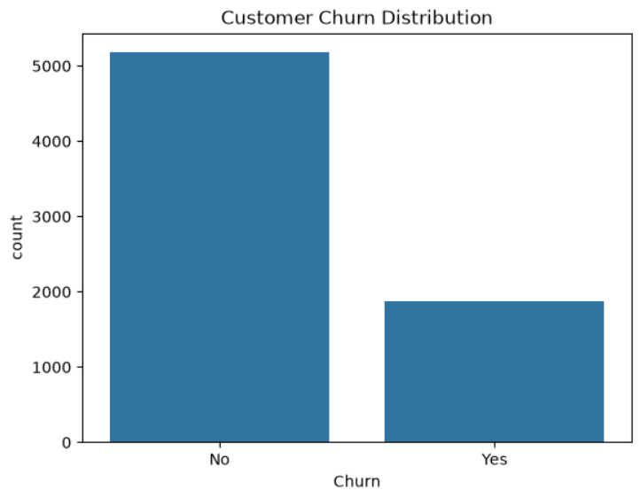
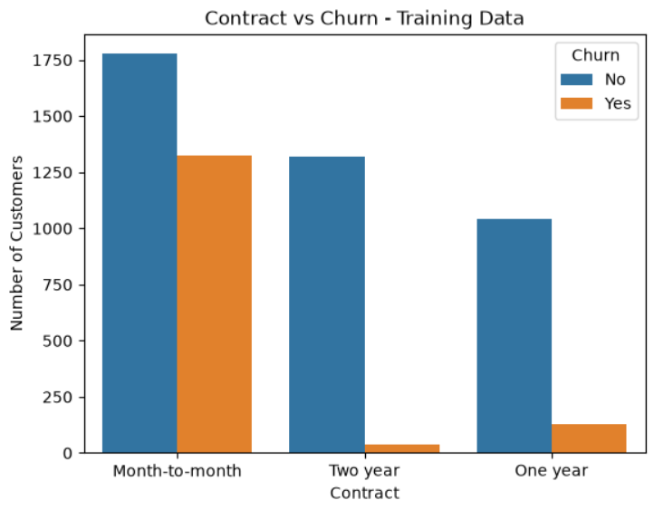
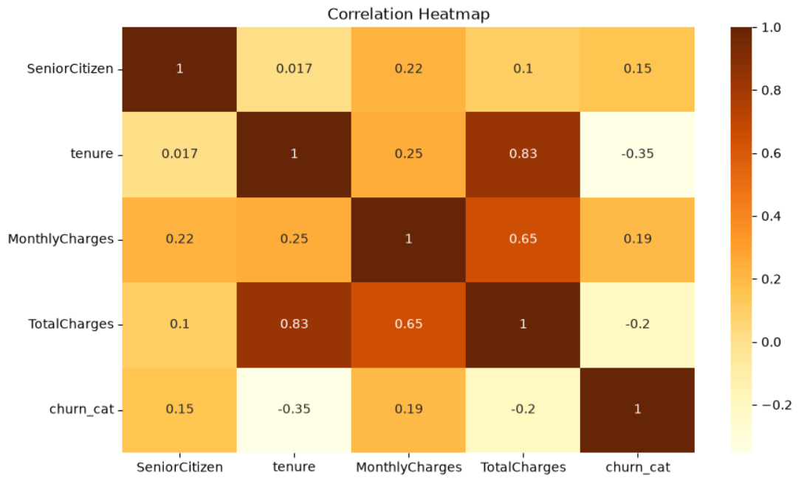
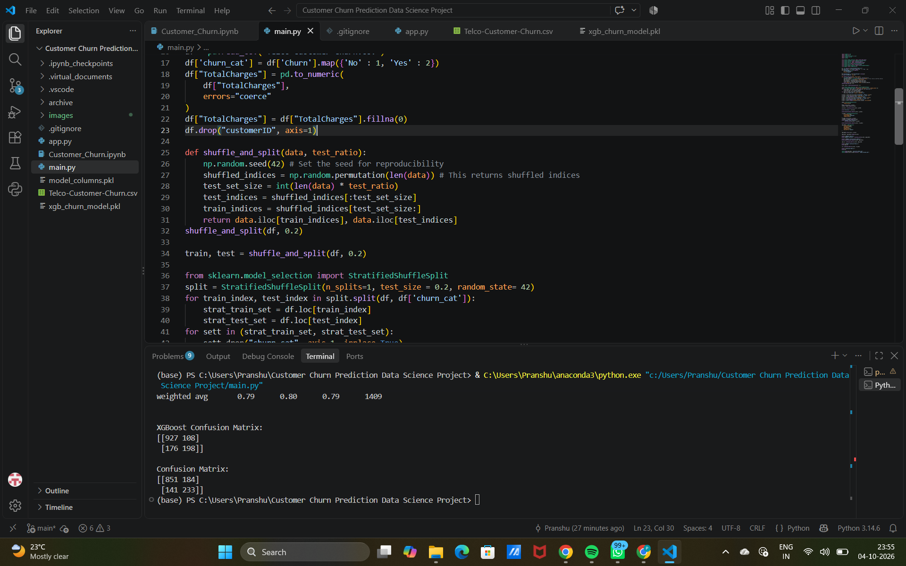
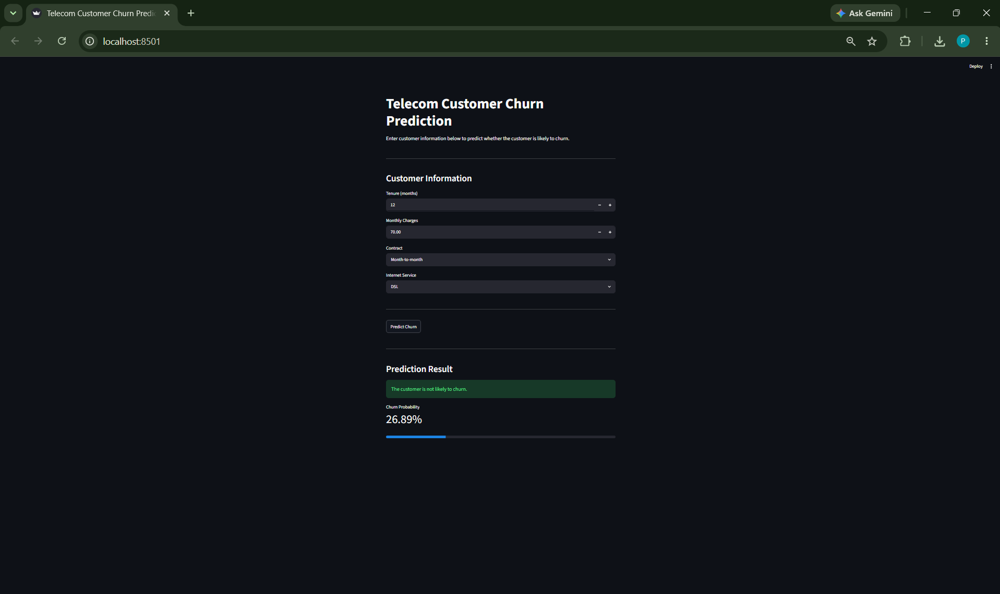

# 📞 Customer Churn Prediction

A machine learning project that predicts whether a telecom customer is likely to churn.

This project started with exploring customer data and understanding what factors are related to churn. I then prepared the data, trained multiple classification models, compared their performance, and finally used the best-performing model to build an interactive Streamlit application for making churn predictions.

---

## 📌 Project Overview

Customer churn is an important problem for telecom companies because losing existing customers can directly affect revenue and growth.

The goal of this project is to use historical customer information to identify customers who are more likely to leave the service.

The project covers the complete machine learning workflow:

**Data → Cleaning → Exploratory Data Analysis → Preprocessing → Model Training → Evaluation → Prediction App**

---

## 🎯 Objective

The main objectives of this project were:

- Understand the customer churn dataset.
- Explore patterns in customer behavior.
- Identify variables that may be related to churn.
- Clean and prepare the data for machine learning.
- Compare different classification models.
- Evaluate the models using accuracy, precision, recall and F1-score.
- Select a suitable model for churn prediction.
- Build a simple interactive application for making predictions.

---

## 📊 Dataset

The project uses the **Telco Customer Churn** dataset.

The dataset contains **7,043 customer records** with information related to:

- Customer demographics
- Senior citizen status
- Partner and dependents
- Tenure
- Phone services
- Multiple lines
- Internet service
- Online security
- Online backup
- Device protection
- Technical support
- Streaming services
- Contract type
- Paperless billing
- Payment method
- Monthly charges
- Total charges
- Churn status

The target variable is:

**`Churn`**

- `Yes` → Customer has churned
- `No` → Customer has not churned

---

## 🔍 Exploratory Data Analysis

Before training the models, I explored the dataset to understand its structure and customer behavior.

Some of the analysis included:

- Customer churn distribution
- Customer tenure
- Monthly charges
- Total charges
- Contract types
- Internet service
- Customer demographics
- Numerical feature distributions
- Relationships between different variables

The dataset was also checked for missing values and data types.

`TotalCharges` was converted into a numeric format and missing values were handled before model training.

### 📈 Churn Distribution



### 📊 Contract Type and Churn



### 📊 Correlation / Feature Analysis



> These visualizations were created during the exploratory analysis in the Jupyter Notebook.

---

## 🧹 Data Preprocessing

The following preprocessing steps were performed:

1. Loaded the dataset using Pandas.
2. Created a categorical representation of churn for stratified splitting.
3. Converted `TotalCharges` to numeric values.
4. Handled missing values in `TotalCharges`.
5. Removed `customerID` from the model features.
6. Converted categorical variables into numerical variables using one-hot encoding.
7. Used a **stratified 80/20 train-test split**.
8. Ensured that the test data had the same feature columns as the training data.

The churn target was encoded as:

```text
No  → 0
Yes → 1
```

---

## 🤖 Machine Learning Models

I experimented with three classification algorithms:

### 1. Decision Tree

A basic Decision Tree classifier was used as an initial model.

### 2. Random Forest

A Random Forest classifier with 100 estimators was trained. Class weighting was also used to help deal with the imbalance between churn and non-churn customers.

### 3. XGBoost

XGBoost was used as the final model.

The model was configured with:

- `n_estimators = 100`
- `learning_rate = 0.1`
- `max_depth = 4`
- `random_state = 42`

---

## 📈 Model Performance

The models produced the following accuracy scores on the test set:

| Model | Accuracy |
|---|---:|
| Decision Tree | **72.60%** |
| Random Forest | **78.50%** |
| XGBoost | **79.84%** |

XGBoost achieved the highest accuracy among the three models tested.

### XGBoost Classification Report

| Class | Precision | Recall | F1-Score |
|---|---:|---:|---:|
| No Churn | 0.84 | 0.90 | 0.87 |
| Churn | 0.65 | 0.53 | 0.58 |
| **Overall Accuracy** | | | **79.84%** |

One important observation is that the model performs better at identifying customers who do not churn than customers who actually churn. The churn class has a recall of **0.53**, meaning there is still room for improvement in identifying potential churners.

---

## 🔲 Confusion Matrix

The XGBoost confusion matrix on the test set was:

```text
[[927 108]
 [176 198]]
```

This corresponds to:

- **927** correctly predicted non-churn customers
- **108** non-churn customers incorrectly predicted as churn
- **176** churn customers incorrectly predicted as non-churn
- **198** correctly predicted churn customers



---

## 🏆 Final Model

Based on the models tested, **XGBoost was selected as the final model** because it achieved the highest accuracy:

### **79.84% Accuracy**

The trained XGBoost model was saved using Joblib as:

```text
xgb_churn_model.pkl
```

The training feature columns were also saved as:

```text
model_columns.pkl
```

These files are used by the prediction application.

---

## 🚀 Streamlit Application

To make the project more practical, I created an interactive Streamlit application.

The application allows a user to enter:

- Customer tenure
- Monthly charges
- Contract type
- Internet service

After clicking **Predict Churn**, the application displays:

- Whether the customer is likely to churn
- The predicted churn probability

### Application Flow

```text
Customer Information
        ↓
Data Preparation
        ↓
Trained XGBoost Model
        ↓
Churn Prediction
        ↓
Churn Probability
```

### 📸 Streamlit Application



---

## 🛠️ Technologies Used

### Programming Language

- Python

### Data Analysis

- Pandas
- NumPy

### Data Visualization

- Matplotlib
- Seaborn

### Machine Learning

- Scikit-learn
- XGBoost

### Model Saving

- Joblib

### Application

- Streamlit

### Development Tools

- Jupyter Notebook
- Visual Studio Code
- Git
- GitHub

---

## 📁 Project Structure

```text
Customer-Churn-Prediction/
│
├── Customer_Churn.ipynb
├── Telco-Customer-Churn.csv
├── main.py
├── app.py
├── xgb_churn_model.pkl
├── model_columns.pkl
├── requirements.txt
├── .gitignore
├── README.md
│
└── images/
    ├── churn_distribution.png
    ├── contract_vs_churn.png
    ├── correlation_heatmap.png
    ├── confusion_matrix.png
    └── streamlit_app.png
```

---

## ▶️ How to Run the Project

### 1. Clone the repository

```bash
git clone https://github.com/akapranshu2-boop/Customer-Churn-Prediction.git
```

### 2. Open the project folder

```bash
cd Customer-Churn-Prediction
```

### 3. Install the required libraries

```bash
pip install -r requirements.txt
```

### 4. Run the Streamlit application

```bash
streamlit run app.py
```

### 5. Open the application

Streamlit will provide a local URL in the terminal, usually:

```text
http://localhost:8501
```

---

## 💡 What I Learned

Through this project, I worked on different stages of a machine learning workflow, including:

- Working with a real-world tabular dataset
- Data cleaning and preprocessing
- Handling categorical variables
- Exploratory data analysis
- Stratified train-test splitting
- Training multiple classification models
- Comparing model performance
- Understanding confusion matrices
- Evaluating precision, recall and F1-score
- Saving trained machine learning models
- Building an interactive Streamlit application
- Using Git and GitHub to manage and showcase the project

---

## 🔮 Future Improvements

There are several ways this project could be improved further:

- Hyperparameter tuning for XGBoost
- Improving recall for the churn class
- Trying additional classification algorithms
- Feature selection and feature engineering
- Cross-validation
- Threshold tuning based on the business cost of missing a churner
- Adding more customer features to the Streamlit application
- Deploying the Streamlit application online

---

## 👨‍💻 Author

**Pranshu**

GitHub:  
https://github.com/akapranshu2-boop

---

⭐ If you found this project interesting, feel free to explore the code and notebook.
